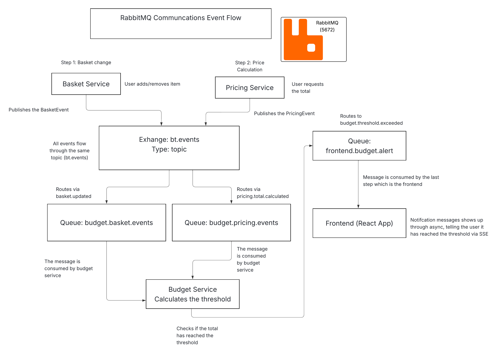

# BudgetTracker
Hi, welcome to my project : )

## Project Overview
This project is a microservices-based application that helps the user track their spending in real time while they are in the grocery store.
The user uses their phone camera to decode the products EAN-13/UPCS barcodes. This allows the user to scan barcodes of products, 
manage their basket and monitor their budget in real-time. 

## Instructions

### Steps to start the project:

This project is intended to run with docker, I can't promise that it will run with other methods.

 - Navigate to the docker directory: **cd docker**
 - Build and start all services: **docker compose up --build** (This will build everything needed for the application)

Sometimes when the application services start before RabbitMQ/PostgreSQL/Consul are fully ready, so their 
initial connection attempt may fail. This can leave the system in a bad state until you restart the affected services. 
So if this happens, please try and build again. 

### When everything has been built correctly, you should be able to access the following: 
 - Gateway: http://localhost:8080
 - Consul: http://localhost:8500
 - RabbitMQ: http://localhost:15672 (Username: app, Password: app)
 - PostgreSQL: Username: postgres, Password: postgres

### Mobile testing with ngrok

You can test this application on the pc, but I heavily recommend using it on the phone, so you can test out the 
main functionality of this project, which is the barcode scanner with the phone camera.

 - Using ngrok is very simple, you first download it from the following link: https://ngrok.com/download
 - You then sign up for a free ngrok account where you get your authtoken
 - You use your authtoken within the terminal using the command: ngrok config add-authtoken <YOUR_AUTH_TOKEN>
 - You need to replace the "<YOUR_AUTH_TOKEN>" with your actual token from ngrok
 - In a new terminal, write: ngrok http 8080. Here you will get the url which you will use on your phone
 - Example of how it will look like: https://shrilly-unrotten-lyndia.ngrok-free.dev

Now you should be able to open up the phone camera without any issues, It has been tested on both iphone and android,
so it should work.

### Important information regarding scanning!

When you try and scan a product, sometimes it might not read the barcode correctly, so when you get an error message saying "Could not find the barcode: Barcode Number", 
it will contain a different number of the barcode then the one I have provided with in the reflection's document word file, you can see these numbers under the barcode.
If this happens, please try again, it should work. With the delivery of the exam, I will put the barcodes with my reflection's document word file that contains various barcodes which you can try to scan.
You can try and scan whatever food products you can find within your area, which should work for the most part from what I have tested,
but I am not going to promise that this will work. With the barcodes that I am giving you, I have scanned and tested them, making sure that these do work before delivery. 

Regarding the set a budget functionality. It sometimes can be a little weird and not always work as expected. 
It works for the most part when I have set a budget, and it reacts to the budget immediately. But sometimes, 
when I put in a new budget, it might not react to the change that has been made. So here I recommend on reloading the app and set a new budget.

### User stories:

- As a user, I want to be able to scan a product's barcode using my phone's camera
- As a user, I want to the key information regarding the product like name, brand, price and images
- As a user, I want to manage my shopping basket with real-time updates
- As a user, I want to receive budget alerts when approaching or exceeding the spending limit
- As a user, I should be able to set the budget threshold that I want with customized warning percentages
- As a user, I want to be able to add an item manually or in case the scanning goes wrong

This project integrates with the Open Food facts API, this makes it possible to automatically fetch
the products information based on the EAN/UPC barcodes.

### Key Features
- Real-time basket updates using the Server-Sent Events (SSE)
- Asynchronous event-driven communication via RabbitMQ
- Service discovery and health monitoring with Consul
- Centralized API gateway for request routing
- Persistent data storage with PostgreSQL
- React frontend with Typescript and Vite

# Systems Architecture

The architecture image does not show up here. But you can find it in ./images/main-architecture.png

### Synchronous Communication (HTTP/REST)
 - Frontend -> Gateway: All request is routed through the gateway
 - Gateway -> Services: Gateway forwards requests to microservices
 - Catalog Service: Fetches products data from Open Food Facts API, and stores them
 - Basket Service: Provides SSE stream for real-time basket updates
 - Budget Service: Provides SSE stream for real-time budget alerts

# RabbitMQ Architecture

The architecture image does not show up here. But you can find it in ./images/rabbitmq-architecture.png

### Asynchronous Communication (RabbitMQ)
- Basket Service and Pricing Service both publish an event to bt.events
- The messages gets sent through the queues budget.basket.events and budget.pricing.events
- both of the queues then sends a message to the budget service which then calculates the threshold
- This message gets sent to the queue frontend.budget.alert, which then sends the message to the frontend
- This message within frontend triggers a notification that the user has reached or exceeded the threshold

# Architecture Decisions
 - RabbitMQ is used to be the message broker to enable asynchronous communication between services.
 - Consul is used for service discovery, health checks and load balancing.
 - SSE is used for real-time updates instead of websockets, this is to reduce the complexity of the system.
 - PostgreSQL has been used as the selected database, it is stable, reliable and easy to run via docker
 - The barcode lookup is not stored locally, but rather done through OpenFoodFacts API
 - The system is not made to track user account or sessions and authentications, it assumes that only one user is going to actively interact with the app
 - The project has been design to do simple calculations like basic price totals, budget thresholds and a basic event flow

# Team Contribution
This project was completed individually by candidate: PG3402.
All the implementation, architecture design and documentation were done by the candidate

